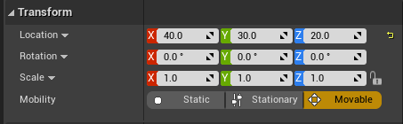

2020-10-21_11:41:21

# Actor mobility

Actor mobility control how an Actor may move during gameplay.
Some types of Actors have additional restrictions based on mobility.
The restrictions are often a list of Details Panel settings that may not be changed during gameplay.
The main advantage of reduced mobility is the improved performance that can be gained from precomputation or algorithms that can take advantage of the reduced state space.
Mobility is set in the Actor's Details Panel, right below the transformation widget.

- Static: The Actor can never move and extra Actor type specific restrictions apply.
- Stationary: The Actor can never move, but the extra Actor type specific restrictions are loosened.
- Movable: The Actor is fully dynamic, it can move and no Actor type specific restrictions apply.

## Actor type specific effects

This section lists extra restrictions or properties of various Actor types during gameplay.

### Light
- Static
    - Cannot change color or intensity.
    - Can bake illumination and shadows into lightmaps for Static and Stationary Static Meshes.
    - Can illumination be baked for Movable Static Meshes, like for Stationary Lights?
    - Can illuminate Movable Static Meshes with an indirect lighting method. I assume these support shadows.
- Stationary:
    - Can change color and intensity.
    - Can bake illumination into lightmaps (How? What is stored in the lightmap?).
    - Can cast dynamic shadows for Movable Static Meshes.
- Movable:
    - Can be added and removed.
    - Can move.
    - Can change color and intensity.
    - Can cast dynamic shadows.
    - High computation cost for shadows.
    - Non-shadow casting Movable lights are not computationally expensive.

[[2021-01-22_22:09:22]] [Indirect lighting methods](./Indirect%20lighting%20methods.md)  

### Static Mesh

- Static
    - Can bake shadows into lightmaps.
    - Can have animated materials.
- Stationary
    - Cannot bake shadows into lightmaps.
    - Treated as Movable to Static and Stationary Lights.
    - Can use a Cached Shadow Map when illuminated by a Movable Light.
- Movable
    - Can be added and removed.
    - Can move.
    - Cannot bake shadows into lightmaps.
    - Can cast fully dynamic shadows from Stationary and Movable Lights.
    - Can use an indirect lighting method when illuminated by a Static Light.
    - 

[Mobility @ docs.unrealengine.com](https://docs.unrealengine.com/en-US/Engine/Actors/Mobility/index.html)
