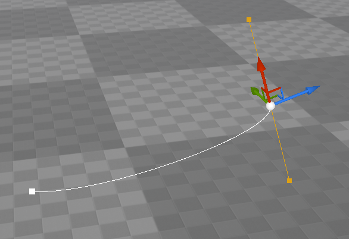

2021-08-26_08:50:46

# Component Visualizer - Widget location

Unreal Editor uses a Transform Widget to let the user transform objects.
The transformed object can be an Actor in the level, a Component in an Actor, or a custom attribute of a Component.
By "attribute" I mean anything that a Component might have, often a UProperty.
For example one of the control points of a spline.



The editor provide code for transforming Actors and Components, but custom attributes require custom code.
The custom code lives in the Component Visualizer associated with the Component type.
The Component Visualizer has three virtual methods that deal with interactive transformations:
- `GetWidgetLocation`
- `HandleInputDelta`
- `IsVisualizingArchetype`

These functions are called by Unreal Editor from `FEditorViewportClient::Draw`.
There is also `ISCSEditorCustomization` which seem related but I know nothing about it.

`GetWidgetLocation` should provide the location, in world space, where the transformation widget should be placed.

```cpp
bool FMyVisualizer::GetWidgetLocation(
    const FEditorViewportClient* ViewportClient, FVector& OutLocation) const
{
    UMyComponent* MyComponent = GetEditedMy();
    if (MyComponent == nullptr)
    {
        return false;
    }
    OutLocation = MyComponent->MyVectorUProperty;
    return true;
}
```

Getting the edited Component is complicated.
The strategy I've seen uses Hit Proxies that store a pointer to the Component and a Hit Proxy callback on the Visualizer that read that pointer and remembers it for use in `GetWidgetLocation`.

[[2020-08-06_18:48:41]] [Component visualizer](./Component%20visualizer.md)  