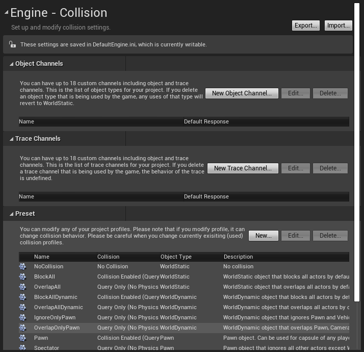
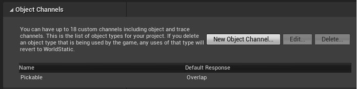

2021-06-28_09:12:50

# Detail Customization examples in the engine

When I first started learning about Detail Customization I used the Spline Component as an example.
That may have been a bad idea because the Spline Component does a bunch of custom stuff not often done in the engine.
Such as using `FComponentPropertyPath` and tight integration with the Spline Component Visualizer.

This note is a survey of a few other Detail Customization implementations that will hopefully give a better intuition for what a "normal" implementation looks like.
There is very little thought behind the selection of Detail Customizations being surveyed.
Anything that I can find the resulting widgets within Unreal Editor is fair game.

This note contains several codes snippets.
These are inspired by the associated engine cope, but is not necessarily pure copy-paste.
I remove anything I don't understand or that doesn't contribute to the thing I'm trying to understand.

## Directional Light Component

Customized in `DirectionalLightComponentDetails.(h|cpp)`.
This Detail Customization does two changes:
- Add Is Enabled to the two Dynamic Shadow Distance.
- Add extra meta data to the Intensity UProperty.

The two Is Enable callbacks use the Mobility UProperty to determine which of the two Dynamic Shadow Distance should be enabled.
The UProperty is stored as a member variable and is declared as
```cpp
TSharedPtr<IPropertyHandle> MobilityProperty;
```
The UProperty is fetched with
```cpp
MobilityProperty = DetailBuilder.GetProperty(
    "Mobility", USceneComponent::StaticClass());
```
The Is Enabled callback is added by getting the UProperty and re-adding it to it's original Category and then calling `IsEnabled` on the returned `IDetailPropertyRow`.
The handle is fetched with
```cpp
TSharedPtr<IPropertyHandle> MovableShadowRadiusProperty =
    DetailBuilder.GetProperty("DynamicShadowDistanceMovableLight");
```
The UProperty is re-added with an Is Enabled callback with
```cpp
ShadowMapCategory.AddProperty(MovableShadowRadiusProperty)
    .IsEnabled(TAttribute<bool>(
        this, &FDirectionalLightComponentDetails::IsLightMovable));
```
The `IsLightMovable` member function looks at the Mobility Property to determine if the light is movable or not
```cpp
bool  FDirectionalLightComponentDetails::IsLightMovable() const
{
    uint8 Mobility;
    MobilityProperty->GetValue(Mobility);
    return (Mobility  ==  EComponentMobility::Movable);
}
```

Intensity meta data is added by calling `SetInstanceMetaData` on the Intensity Property Handle.
I think the meta data must be changed because of a conflict with Point Light, different units.
```cpp
TSharedPtr<IPropertyHandle> LightIntensityProperty =
    DetailBuilder.GetProperty("Intensity", ULightComponentBase::StaticClass());
LightIntensityProperty->SetInstanceMetaData("UIMin",TEXT("0.0f"));
LightIntensityProperty->SetInstanceMetaData("UIMax",TEXT("150.0f"));
LightIntensityProperty->SetInstanceMetaData("SliderExponent", TEXT("2.0f"));
LightIntensityProperty->SetInstanceMetaData("Units", TEXT("lux"));
LightIntensityProperty->SetToolTipText(
    LOCTEXT("DirectionalLightIntensityToolTipText", "Maximum illumination from the light in lux"));
```


## Niagara Component Details

I'm looking at this one because it does customization of both per -instance and shared data.


### Class definition

The customization is registered as a Class Layout in `NiagaraEditorModule.cpp`:
```cpp
PropertyModule.RegisterCustomClassLayout(
    UNiagaraComponent::StaticClass()->GetFName(),
    FOnGetDetailCustomizationInstance::CreateStatic(
        &FNiagaraComponentDetails::MakeInstance));
```

The header file contains
- `MakeInstace`.
- `CustomizeDetails`.
- `OnWorldDestroyed`.
- `OnPiEEnd`.
I assume this is short for On Play In Editor End.
- Weak pointer to an `UNiagaraComponent` named `Component`.
- Raw pointer to an `IDetailLayoutBuilder` named `Builder`.


### CustomizeDetails

`Builder` is assigned first thing in `CustomizeDetails`.
The Override Parameters UProperty is hidden.
```cpp
TSharedPtr<IPropertyHandle> LocalOverridesPropertyHandle =
    DetailBuilder.GetProperty("OverrideParameters");
if (LocalOverridesPropertyHandle.IsValid())
{
    LocalOverridesPropertyHandle->MarkHiddenByCustomization();
}
```

Override Parameters is declared as follows in `NiagaraComponent.h`:
```cpp
UPROPERTY()
FNiagaraUserRedirectionParameterStore OverrideParameters;
```

A few other UProperties are hidden in a similar fashion.

I have learned that Property Handles are really important, which means the the Detail Layout Builder is also important since it is what provides the Property Handles.


## Actor

Customized in `ActorDetails.(h|cpp)`.

Keeps an array of selected Actors as a member variable.
```cpp
TArray<TWeakObjectPtr<AActor>> SelectedActors;
```
It is filled using `GetSelectedObjects` on the passed `IDetailLayoutBuilder`:
```cpp
const TArray<TWeakObjectPtr<UObject>>& SelectedObjects =
    DetailLayout.GetSelectedObjects();
for (int32 ObjectIndex = 0; ObjectIndex < SelectedObjects.Num(); ++ObjectIndex)
{
    AActor* Actor = Cast<AActor>(SelectedObjects[ObjectIndex].Get());
    if (Actor != NULL)
    {
        SelectedActors.Add(Actor);
    }
}
```
It is done with the following comment:
> Store the selected actors for use later. Its fine to do this when CustomizeDetails
> is called because if the selected actors changes, CustomizeDetails will be called
> again on a new instance and our current resource would be destroyed.

I don't know if that's specific to Actor Details Panels, or if it's safe to keep pointers also to Components in a Component Detail Customization.

The Blueprint the Actor was generated from, if any, is found with
```cpp
UBlueprint* Blueprint = Cast<UBlueprint>(Actor->GetClass()->ClassGeneratedBy);
```

It uses
```
Actor->FindComponentByClass<UBillboardComponent>()
```
to determine if any of the selected Actors has a Billboard Component.
If not, the Sprite Scale UProperty is hidden with
```cpp
DetailLayout.HideProperty(GET_MEMBER_NAME_CHECKED(AActor, SpriteScale));
```

The transform part of the Details Panel is added as a `IDetailCustomNodeBuilder` named `FComponentTransformDetails`.
```cpp
TSharedRef<FComponentTransformDetails> TransformDetails =
    MakeShareable(new  FComponentTransformDetails(
        DetailBuilder.GetSelectedObjects(), DetailBuilder));

IDetailCategoryBuilder& TransformCategory =
    DetailBuilder.EditCategory(
        "TransformCommon", LOCTEXT("TransformCommonCategory", "Transform"),
        ECategoryPriority::Transform);

TransformCategory.AddCustomBuilder(TransformDetails);
```
The above creates a new Component Transform Details, a subclass of Custom Node Builder, and passes in the list of selected objects and the `IDetailLayoutBuilder` that `CustomizeConstraints` got from Unreal Editor.

Component Transform Details is defined in `ComponentTransformDetails.(h|cpp)`.
Custom Node Builder create their child widgets in the Generate Child Content member function.
A row each for Location, Rotation, and Scale is created with Add Custom Row.
Copy Action and Paste Action is set, presumably to handle Ctrl+C / Ctrl+V.
Each Copy Action is created with
```cpp
FUIAction(
    FExecuteAction::CreateSP(
        const_cast<FComponentTransformDetails*>(this),
        &FComponentTransformDetails::OnCopy, TransformField),
    FCanExecuteAction::CreateSP(
        const_cast<FComponentTransformDetails*>(this),
        &FComponentTransformDetails::OnCanCopy, TransformField)
);
```
I don't think the `TransformField` at the end of each `CreateSP` is part of the `FUIAction` API, I think it's a parameter that's simply passed through to `OnCopy` and `OnCanCopy`.

The Custom Row is given both a Name Content and a Value Content.
The Name Content is a Combo Button where Button Content is a Text Block and a Menu Builder is used to create a local / global switch.
The Value Content is a Horizontal Box with a Vector Input Box, a Box just for alignment, and a Button.
The Button is the reset-to-default button.
The Vector Input Box is the main editing widget.
It has the getters Get Location X, Get Location Y, and Get Location Z.
It has the setter On Set Transform Axis with different parameters for each axis, and changed vs commit.
It also has On (Begin|End) Slider Movement.
On Set Transform Axis calls On Set Transform, which is a big function.


### On Set Transform

It has two `FProperty*` on the stack, Value Property and Axis Property.
They are filled differently depending on if the Location, Rotation, or Scale was edited.
Value Property is the Property for the entire UProperty, e.g., Location.
It is fetched with
```
ValueProperty = FindFProperty<FProperty>(
    USceneComponent::StaticClass(),
    USceneComponent::GetRelativeLocationPropertyName());
```
for the Location property.
Axis Property is the element property within the Vector, either the X, Y, or Z value.
It is fetched with
```
AxisProperty =
    FindFProperty<FFloatProperty>(
        TBaseStructure<FVector>::Get(), GET_MEMBER_NAME_CHECKED(FVector, X));
```
for the X axis property.

An `FPropertyChangedEvent` is created on the stack, given the Value Property.
Either Interactive or Value Set is passed depending on if we got here from the changed callback or the commit callback.
An `FEditPropertyChain` is created on the stack.
Both the Axis Property and the Value Property are added as heads to the Property Chain.
An `FPropertyChangedChainEvent` is created on the stack, given the Property Chain.

The selected objects are looped through.
If the object is an Actor, then the Actor's Root Component is fetched.
If the object is not an Actor, then we assume it's a Scene Component.
We check if the Object is a template with Is Template, for later use.
We cache the current value from the Scene Component, either Location, Rotation, or Scale.
An updated vector is created by combining the old and new value, taking from the new only on the edited axis.
If the vector changed and we're committing then `GEditor->BeginTransaction(text)` is called.

Then it does something with the engine World that I don't understand and will never try to replicate.
It involves a `FScopedSwitchWorldForObject`.

If the committed change is not on a Template object then `GEditor->BroadcastBeginObjectMovement` is called for both the Scene Component and the Actor, if the Scene Component was the Actor's Root Component.
For committed changes, call `PreEditChange` on both the Scene Component and the Actor, if Root Component.

Calls Notify Pre Change on the Notify Hook, passing in the Value Property, i.e., the entire Vector.

Call Set Relative Location on the Scene Component.
This is where the actual change happens.
Does loads of stuff.

If the changed object is a Template, call `PropagateDefaultValueChanged`, passing in the Scene Component changed, the Value Property, both the old and the new vector values, and and a `TSet` that will be ignored.

Store the modified object in a list.

This is where the loop over selected objects end.

Then a loop over the modified objects list.
Get a pointer to the Scene Component, either the edited object itself or the Root Component of an Actor.
The pointer is stored twice, one named `SceneComponent` and one named `OldSceneComponent`.
The reason is that we may trigger a Blueprint Reconstruction soon, which will destroy the current Scene Component.
`OldSceneComponent` will continue to point to the potentially invalid Component.
`SceneComponent` will be re-fetched so we're sure it points to a valid object.
We store `SceneComponent->GetPathName(EditedActor)` so that it can be re-fetched later.
The thing that triggers a Blueprint Reconstruction is a call to Post Edit Change Chain Property, to which Property Changed Chain Event is passed.
Only called if the current change was a commit.
Otherwise `SnapshotTransactionBuffer(OldSceneComponent)` is called.
No idea what that is.
After the potential Blueprint Reconstruction the Scene Component pointer is re-fetched with `FindObject<USceneComponent>(EditedActor, *SceneComponentPath)`.
A similar Find Object dance is done if calling Post Edit Change Chain Property on the Actor as well.
If the change was a commit, then we call `GEditor->BroadcastEndObjectMovement`.
Both for the Scene Component and the Actor, if there is one.
That marks the end of the modified objects list loop.

Call `NotifyHook->NotifyPostChange`.
Still don't know what a Notify Hook is.

If a commit change, call `GEditor->EndTransaction`.

Unconditionally call
- `UpdatePivotLocationForSelection`
- `SetPivotMovedIndependently`
- `RedrawLevelEditingViewport`
on `GUnrealEd`

I don't know what the difference is between `GEditor` and `GUnrealEd`.
`GUnrealEd` is an instance of `UUnrealEdEngine`, inherits from `UEngine`.
`GEditor` is an instance of `UEditorEngine`, also inherits from `UEngine`.
In fact, `UUnrealEdEngine` inherits from `UEditorEngine`.
Do the two pointers point to the same object?


## `FCollisionProfileDetails` in `CollisionProfileDetails.(h|cpp)`

The Collision Profiles are part of the Project Settings.
The can be found under Engine > Collisions.
The fact that it's a Project Settings Panel and not a Panel for something in the level may influence how it is implemented.



It contains a few collapsible groups, for Object Channels, Trace Channels, and Preset, each with some buttons and a table.

```cpp
class  FCollisionProfileDetails : public  IDetailCustomization
```
The class inherits from `IDetailCustomization`, as usual.

It has private member functions for widget callbacks.
There are a bunch of these.
Some returning `bool`, some returning `FReply`.
```cpp
// button handlers
FReply  OnNewChannel(bool  bTraceType);
bool  IsNewChannelAvailable() const;
FReply  OnEditChannel(bool  bTraceType);
```

The views themselves, and the backing data, are stored as members.
```cpp
TSharedPtr<SChannelListView> ObjectChannelListView;
TArray<TSharedPtr<FChannelListItem>> ObjectChannelList;
```

A pointer to a Collision Profile is stored as well.
```cpp
UCollisionProfile* CollisionProfile;
```

There are a bunch of helper functions as well, such as.
```cpp
FReply  OnNewChannel(bool  bTraceType);
bool  IsNewChannelAvailable() const;
ECollisionChannel  FindAvailableChannel() const;
void  RefreshChannelList(bool  bTraceType);
void  RefreshProfileList();
void  RemoveChannel(ECollisionChannel  CollisionChannel) const;
```

The collapsible groups are implemented as Categories.
```cpp
IDetailCategoryBuilder& ObjectChannelCategory =
    DetailBuilder.EditCategory("Object Channels");
IDetailCategoryBuilder& TraceChannelCategory =
    DetailBuilder.EditCategory("Trace Channels");
IDetailCategoryBuilder& PresetCategory =
    DetailBuilder.EditCategory("Preset");
```

The Collision Profile is a singleton, so the pointer member points to the Class Default Object.
```cpp
CollisionProfile = GetMutableDefault<UCollisionProfile>();
```

The two Channel Lists, `ObjectChannelList` and `TraceChannelList`, are filled with
```cpp
TraceChannelList.Add(MakeShareable(
    new FChannelListItem(MakeShareable(
        new  FCustomChannelSetup(*Iter)))));
```

The widgets are created with Slate expressions.
Here I'll focus on the Object Channels Category.



The entire thing is held in a Custom Row, created with `IDetailCategoryBuilder::AddCustomRow`.
The sole member of the Custom Row is a Vertical Box.
The Vertical Box contains two slots, one for the description text and the buttons, and one for the table.
The description/buttons slot contains a Horizontal Box.
The description text is a Text Block on which Auto Wrap Text, is enabled, Font is set to `IDetailLayoutBuilder::GetDetailFont`, ToolTip is set to a tool tip created with `IDocumentation::Get()->CreateToolTip`, and Text set with `LOCTEXT`.

The New Object Channel button has On Clicked and Is Enabled callbacks both bound to member functions using `(this, &FCollisionProfileDetail::MyFunction)` syntax.
An extra `false` is passed to `OnClicked`, I think that is just passed on to the member function.
`IsNewChannelAvailable` does a Array size check and returns `true` is still room.
`OnNewChannel` creates a model window with some input widgets for configuration.
The window is created with
```cpp
TSharedRef<SWindow> WidgetWindow = SNew(SWindow)
    .Title(LOCTEXT("WindowTileId", "My Window Title"))
    .ClientSize(FVector2D(MY_WINDOW_WIDTH, MY_WINDOW_HEIGHT))
    .SupportsMaximize(false)
    .SupportsMinimize(false)
    .SizingRule(ESizingRule::UserSized);
```
The window is filled with `SetContent`.
`SetContent` takes a Slate widget to put in the window.
They have a custom widget containing all the input widgets.
A pointer to the widget is stored on the stack, and assigned with `SAssignNew`.
The window the widget is part of is sent to the widget.
```cpp
TSharedPtr<MyDialogWidget> DialogWidget;
WidgetWindow->SetContent(
    SAssignNew(DialogWidget, MyDialogWidget)
    .WidgetWindow(WidgetWindow)
    .OnValidateChannel(this, &FCollisionProfileDetails::IsValidChannelSetup)
);
```
With the window created and filled we display it by giving it to `GEditor`.
```cpp
GEditor->EditorAddModalWindow(WidgetWindow);
```
I think execution will pause here until the modal window is closed.
When we continue the change, if any, is applied to the Collision Profile singleton and `UpdateChannel` is called.

```cpp
CollisionProfile->DefaultChannelResponses.Add(ChannelEditor->ChannelSetup);
UpdateChannel(bTraceType);
```
(
TODO: Read more about how the modal window works. That's a separate topic. This entire section is a separate topic and should be moved to a modal window creation note.
)


## Possible `CustomizeDetails` implementations to survey

```
Editor/DetailCustomizations/Private/DirectionalLightComponentDetails.cpp:

18

19:  void  FDirectionalLightComponentDetails::CustomizeDetails( IDetailLayoutBuilder&  DetailBuilder )

20 {


Editor/DetailCustomizations/Private/ActorComponentDetails.cpp:

27

28:  void  FActorComponentDetails::CustomizeDetails( IDetailLayoutBuilder&  DetailBuilder )

29 {


Editor/DetailCustomizations/Private/ActorDetails.cpp:

67

68:  void  FActorDetails::CustomizeDetails( IDetailLayoutBuilder&  DetailLayout )

69 {


Editor/DetailCustomizations/Private/AmbientSoundDetails.cpp:

36

37:  void  FAmbientSoundDetails::CustomizeDetails( IDetailLayoutBuilder&  DetailBuilder )

38 {


Editor/DetailCustomizations/Private/AnimationAssetDetail.cpp:

22

23:  void  FAnimationAssetDetails::CustomizeDetails(IDetailLayoutBuilder&  DetailBuilder)

24 {


Editor/DetailCustomizations/Private/BodyInstanceCustomization.cpp:

1309

1310:  void  FBodyInstanceCustomizationHelper::CustomizeDetails( IDetailLayoutBuilder&  DetailBuilder, TSharedRef<IPropertyHandle\> BodyInstanceHandler)

1311 {


Editor/DetailCustomizations/Private/BodySetupDetails.cpp:

22

23:  void  FBodySetupDetails::CustomizeDetails( IDetailLayoutBuilder&  DetailBuilder )

24 {


99

100:  void  FSkeletalBodySetupDetails::CustomizeDetails(IDetailLayoutBuilder&  DetailBuilder)

101 {


Editor/DetailCustomizations/Private/CameraDetails.cpp:

40 BEGIN\_SLATE\_FUNCTION\_BUILD\_OPTIMIZATION

41:  void  FCameraDetails::CustomizeDetails( IDetailLayoutBuilder&  DetailLayout )

42 {


Editor/DetailCustomizations/Private/FbxImportUIDetails.cpp:

218

219:  void  FFbxImportUIDetails::CustomizeDetails( IDetailLayoutBuilder&  DetailBuilder )

220 {


Editor/DetailCustomizations/Private/FbxSceneImportDataDetails.cpp:

32

33:  void  FFbxSceneImportDataDetails::CustomizeDetails( IDetailLayoutBuilder&  DetailBuilder )

34 {


Editor/DetailCustomizations/Private/LightComponentDetails.cpp:

20

21:  void  FLightComponentDetails::CustomizeDetails( IDetailLayoutBuilder&  DetailBuilder )

22 {


Editor/DetailCustomizations/Private/LocalLightComponentDetails.cpp:

17

18:  void  FLocalLightComponentDetails::CustomizeDetails( IDetailLayoutBuilder&  DetailBuilder )

19 {


61

62:  void  FLocalLightComponentDetails::CustomizeDetails(const  TSharedPtr<IDetailLayoutBuilder>&  DetailBuilder)

63 {


Editor/DetailCustomizations/Private/MeshComponentDetails.cpp:

15

16:  void  FMeshComponentDetails::CustomizeDetails( IDetailLayoutBuilder&  DetailLayout )

17 {


Editor/DetailCustomizations/Private/PhysicsConstraintComponentDetails.cpp:

850

851:  void  FPhysicsConstraintComponentDetails::CustomizeDetails( IDetailLayoutBuilder&  DetailBuilder )

852 {


Editor/DetailCustomizations/Private/PrimitiveComponentDetails.cpp:

55

56:  void  FPrimitiveComponentDetails::CustomizeDetails( IDetailLayoutBuilder&  DetailBuilder )

57 {


Editor/DetailCustomizations/Private/ReflectionCaptureDetails.cpp:

24

25:  void  FReflectionCaptureDetails::CustomizeDetails( IDetailLayoutBuilder&  DetailLayout )

26 {


Editor/DetailCustomizations/Private/SceneComponentDetails.cpp:

143

144:  void  FSceneComponentDetails::CustomizeDetails( IDetailLayoutBuilder&  DetailBuilder )

145 {


Editor/DetailCustomizations/Private/SkyLightComponentDetails.cpp:

27

28:  void  FSkyLightComponentDetails::CustomizeDetails( IDetailLayoutBuilder&  DetailLayout )

29 {


105

106:  void  FSkyLightComponentDetails::CustomizeDetails(const  TSharedPtr<IDetailLayoutBuilder>&  DetailBuilder)

107 {


Editor/DetailCustomizations/Private/SoundBaseDetails.cpp:

13

14:  void  FSoundBaseDetails::CustomizeDetails(IDetailLayoutBuilder&  DetailBuilder)

15 {


Editor/DetailCustomizations/Private/SoundSourceBusDetails.cpp:

21

22:  void  FSoundSourceBusDetails::CustomizeDetails(IDetailLayoutBuilder&  DetailBuilder)

23 {


Editor/DetailCustomizations/Private/SoundWaveDetails.cpp:

23

24:  void  FSoundWaveDetails::CustomizeDetails(IDetailLayoutBuilder&  DetailBuilder)

25 {


Editor/DetailCustomizations/Private/SplineComponentDetails.cpp:

747

748:  void  FSplineComponentDetails::CustomizeDetails(IDetailLayoutBuilder&  DetailBuilder)

749 {


Editor/DetailCustomizations/Private/StaticMeshActorDetails.cpp:

30

31:  void  FStaticMeshActorDetails::CustomizeDetails( IDetailLayoutBuilder&  DetailBuilder )

32 {


Editor/DetailCustomizations/Private/StaticMeshComponentDetails.cpp:

21

22:  void  FStaticMeshComponentDetails::CustomizeDetails(IDetailLayoutBuilder&  DetailBuilder)

23 {


Editor/DetailCustomizations/Private/WorldSettingsDetails.cpp:

30

31:  void  FWorldSettingsDetails::CustomizeDetails( IDetailLayoutBuilder&  DetailBuilder )

32 {
```