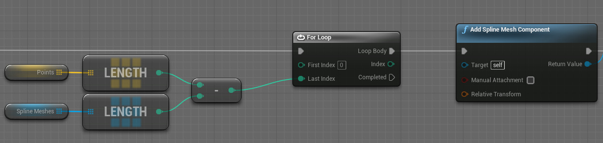

2021-05-13_22:23:55

# For loop

A Blueprint for-loop evaluates its Last Index input on every iteration.

The following structure will not create Spline Mesh Components until there is one per point.
Because for each new Component the Last Index input is reduced by one so the loop will terminate half-way.

