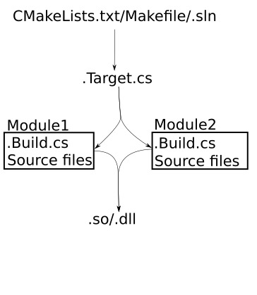

2021-02-19_21:30:15

# Modules Build.cs and Target.cs

A Project consists of multiple Modules.
The Modules that a Projects contains are listed in the Project's `.uproject` file.
How a Module is built, compiler flags and the like, is specified in the Module's `.Build.cs` file.
Multiple source files from a Module can passed to the compiler at once, a so-called unity build.

A Target is a link from the build system to the modules.
Each Target lists the modules that should be built when the target is triggered.
Building a Target results in a dynamically linked library that the engine loads during startup.

Modules are a logical organization of functionality and their dependencies.
Targets are the physical manifestation of these modules, clumped together into libraries on disk.

Module:
- Name. 
    Declared in `.uproject`, `Source` directory name, `ModuleRules` subclass name.
- Type: Runtime, Editor, etc.
    Declared in `.uproject` 
- Loading phase.: Default, PostEngineInit, etc
    Declared in `.uproject`.
- PCHUsage: `UseExplicitOrSharedPCHs`, etc.
    Declared in `.Build.cs`.
- Module dependencies.
    Declared in `.Build.cs`.

Target:
- Type: Game, Editor, etc.
- DefaultBuildSettings: V2, etc.
- ExtraModuleNames
    List of additional modules to be compiled into the target.
    Not sure what the "extra" means. Is there a list of non-additional modules that are always included?

[Gameplay Modules @ docs.unrealengine.com](https://docs.unrealengine.com/en-US/ProgrammingAndScripting/GameplayArchitecture/Gameplay/index.html)  
[Build Configuration @ docs.unrealengine.com](https://docs.unrealengine.com/en-US/ProductionPipelines/BuildTools/UnrealBuildTool/BuildConfiguration/index.html)  
[Targets @ docs.unrealengine.com](https://docs.unrealengine.com/en-US/ProductionPipelines/BuildTools/UnrealBuildTool/TargetFiles/index.html)  