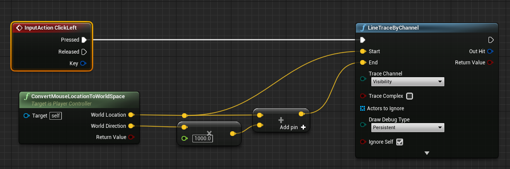

2020-12-10_09:48:27

# Mouse picking


Project mouse cursor position onto a world plane.

```c++
std::optional<FVector> AMyPlayerController::ProjectMouseLocationToPawn() const
{
    if (!GetPawn())
    {
        return std::nullopt;
    }

    FVector WorldLocation;
    FVector WorldDirection;
    
    if (!DeprojectMousePositionToWorld(WorldLocation, WorldDirection))
    {
        return std::nullopt;
    }

    const FPlane PawnPlane(GetPawn()->GetActorLocation(), FVector::UpVector);
    WorldLocation = FMath::RayPlaneIntersection(
        WorldLocation, WorldDirection, PawnPlane);

    return WorldLocation;
}
```

