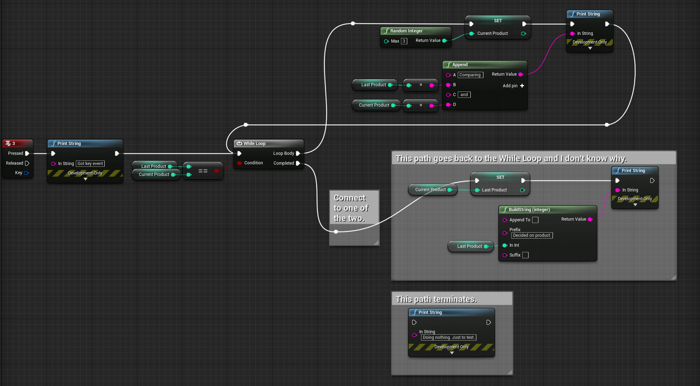

2020-08-22_18:27:54

# Oddities

Here I list behavior that surprised me, explain why I was surprised, and hopefully why Unreal Engine behaves the way it does and provide a solution to how to achieve what I want.

## Play button grayed out

The Play button in the Level Editor Toolbar has been grayed out.
I don't know why.
I don't see any compiler errors in my Blueprints.

**solution**  
It was because lighting has finished building and a small dialog in the lower-left corner of my screen, far away from the editor, wanted me to click "Apply".
Play button active again.


## Editor stuck in fullscreen

I can't resize my editor anymore, It's stuck in fullscreen.
I can click the maximize/unmaximize in the top right corner which causes the titlebar to change slightly and the button to change icon, but the window remain fullscreened.
Clicking and draging the titlebar does nothing, and the same for all edges and corner.
My Windows Manager has a window menu that I can open with Alt+Space. Unmaximize is grayed out.
I tried forcing it with `wmctrl -b remove,maximized(_vert)|(_horz)|()`, didn't help.

**Solution**:
Opening another project I also get a fullscreen window, but this time I can Alt+Space > Unmaximize.
I hope the new window size will be carried over to the first project.
Back in original project, no Window Manager Unmaximize works and I get a free-floating window. :D


## Jump back to while loop forever

I want to generate a random number sequence without consecutive duplicates.
I have a keyboard event and two integers, `Last` and `Current`.
When the event is fired I randomly regenerate `Current` until it's different from `Last`.
When different I set `Last` to the value of `Current` and then end the execution.



This should implement the following:
```c++
int LastProduct = -1;
int CurrentProduct = -1;

void On3()
{
    print("Got key event");
    while (LastProduct == CurrentProduct)
    {
        CurrentProduct = RandomInteger(3);
        print("Comparing " + ToString(LastProduct) + " and " + ToString(CurentProduct));
    }
    LastProduct = CurrentProduct;
    print("Decided on product " + ToString(LastProduct));
}

```

It's as if the While Loop node remain active and get re-run as it detects that I changed one of the parts of the condition.

**Solution**  
Brain fart. I have an execution wire from the end of the `Loob Body` path back to the while loop. That doesn't mean "I'm done with this iteration", it means "Start a new While Loop inside the body of the outer one." That's not what I want. The solution is to simply remove that wire. Doing the next iteration is built into the While Loop node when the execution path of the `Loop Body` ends.
